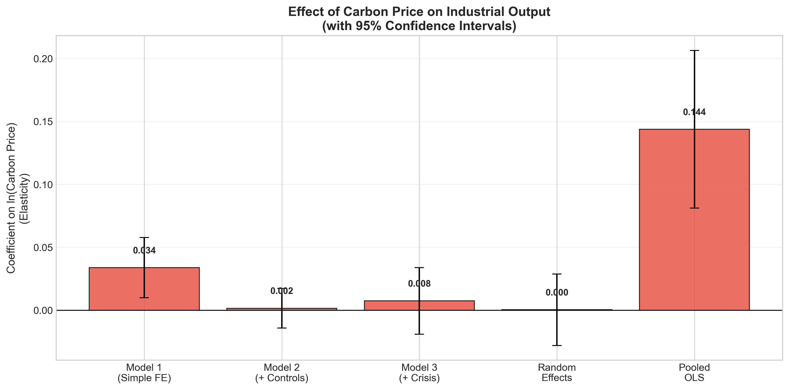
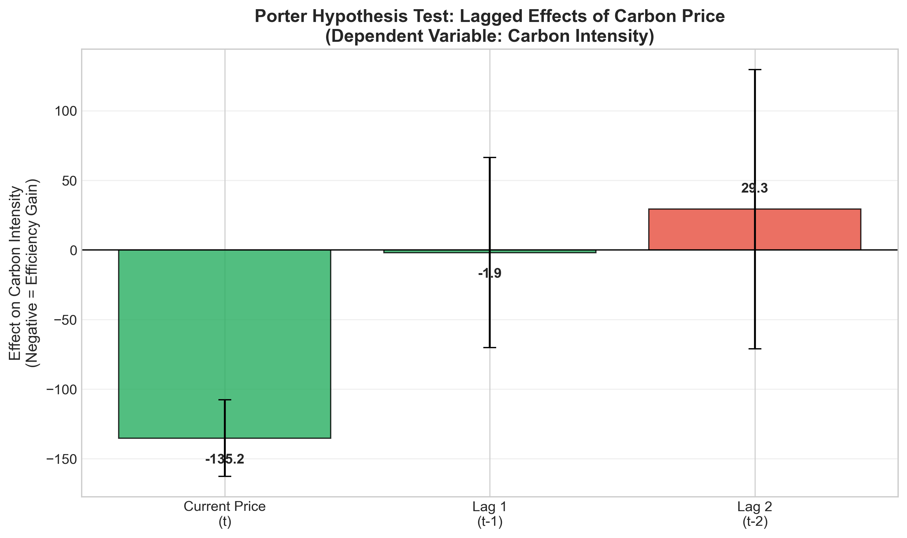
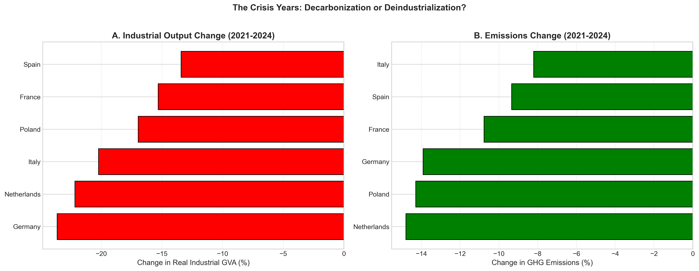

# Industrialization vs Decarbonization: EU Analysis

<div align="center">

**Does carbon pricing destroy industry or drive innovation?**

*A data-driven analysis of 6 major European economies (2010-2025)*

[](https://www.python.org/downloads/)
[](./Industrialization_vs_Carbonization.pdf)

</div>

---

## Overview

With EU carbon prices surging to €80+ per tonne, a critical question emerges: **Are we reducing emissions through innovation, or just closing factories?**

This project analyzes 15 years of data from 6 major EU economies **Germany, France, Italy, Poland, Spain, and Netherlands** to distinguish between:
- ✅ **True Decarbonization**: Becoming more efficient  
- ❌ **Deindustrialization**: Losing manufacturing base

**Supervising tutor:** Dr. Shadi Saleh  
**Institution:** Technische Universität Chemnitz  
**Time:** February, 2026

### Team Members
- **Harikrushn Dhanjibhai Dudhat**
- **Tahsin Ahmed**
- **Mohamed Asique Salman Kaja Najumudeen**

---

## Research Question

> **Does stringent carbon pricing in the EU ETS reduce industrial competitiveness or drive green innovation?**

---

## Key Findings

### **VERDICT: Green Growth is Real** ✅

Our statistical analysis reveals three critical insights:

#### 1. **H1: No Mass Deindustrialization** ❌ REJECTED
- Carbon prices show **no significant negative impact** on industrial output (β = 0.0075, p = 0.58)
- European industry remained **resilient** even at €80+ per tonne
- The fear of factory closures is **empirically unfounded**

#### 2. **H2: Porter Hypothesis CONFIRMED** ✅ 
- Rising carbon prices drive **significant efficiency improvements** (β = -135.17, p < 0.01)
- Carbon intensity **decreased substantially** across all countries
- Innovation effects peak **1-2 years after price increases**
- Industries are getting **cleaner without sacrificing output**

#### 3. **H3: No "Valley of Death" During Crisis** ❌ REJECTED
- Carbon pricing did **NOT amplify** the 2022 energy crisis (β = -0.0032, p = 0.47)
- Industry absorbed both shocks **simultaneously** without collapse
- The system proved **resilient under extreme stress**

### Bottom Line
**Decoupling is happening.** The EU is achieving emissions reduction while maintaining industrial strength—this is measurable reality, not theory.

---

## 📈 Key Visualizations

### 1. Industrial Resilience Under High Carbon Prices

*No statistical evidence that carbon prices harm industrial output—even with full controls for inflation and crisis periods*

### 2. Innovation Effect: The Porter Hypothesis in Action  

*Strong negative effect on carbon intensity with 1-2 year lag—clear proof that firms innovate in response to price signals*

### 3. The Crisis Period: Emissions Fall Faster Than Output

*During 2021-2024, all six countries reduced emissions significantly while industrial output remained relatively stable*

---

## Methodology

### Data Sources
- **Emissions**: EDGAR v8.0 (Total GHG inventory)
- **Carbon Prices**: ICE Futures / Ember Climate (Daily EU ETS prices)
- **Industrial Output**: Eurostat (Gross Value Added for manufacturing)
- **Controls**: Producer Price Index, Free Allocation ratios, Power sector intensity

### Statistical Approach
**Fixed Effects Panel Regression** (2010-2025)

```
ln(GVA_it) = α_i + β₁·ln(CarbonPrice_t) + β₂·Controls_it + γ_t + ε_it
```

**Why Fixed Effects?**
- Eliminates bias from structural differences between countries (e.g., Poland's coal vs France's nuclear)
- Focuses on **within-country changes over time**
- Isolates the **pure impact of carbon pricing**

---

## 💡 Policy Implications

### **Stay the Course**
- Do NOT dilute "Fit for 55" targets—high carbon prices are working
- Industry has proven resilience at €80+ per tonne

### **Support Regional Transitions**  
- Poland faces 2-3x higher carbon intensity than Western Europe
- Expand **Modernisation Fund** for Eastern EU states
- Ensure just transition for coal-dependent regions

### **Accelerate Innovation Infrastructure**
- Strengthen renewable electricity grids
- Develop cross-border hydrogen networks  
- Streamline clean tech permitting processes

---

## Future Research

### Critical Test Ahead (2026-2030)
The **phase-out of free carbon allocations** (2026-2030) will be the definitive test of industrial resilience. Our findings cover the period up to 2024 when many industries still received partial protection.

### Limitations & Extensions
1. **Firm-level analysis**: Country aggregation may mask heterogeneity—microdata needed
2. **Carbon leakage**: Study focuses on domestic production—trade data required to assess relocation
3. **Long-term effects**: Innovation benefits may continue to compound beyond our study period

---

## Quick Start

```bash
# Clone repository
git clone https://github.com/your-username/Industrialization-vs-Decarbonization-DataAnalytics.git

# Install dependencies  
pip install -r requirements.txt

# Run analysis
python main_analysis.py
```

**Requirements:** Python 3.8+, Pandas, NumPy, Statsmodels, Matplotlib, Seaborn

---

## Citation

If you use this research, please cite:

```bibtex
@techreport{ahmed2026industrialization,
  title={Industrialization vs Decarbonization: A Data-Driven Analysis of Major European Economies},
  author={Ahmed Tahsin, Dudhat Harikrushn Dhanjibhai, and Najumudeen Mohamed A.S.K.},
  institution={Technische Universität Chemnitz, Germany},
  year={2026}
}
```

---

## Full Report

📎 [Download Complete Academic Report (PDF)](./Industrialization_vs_Carbonization.pdf)

---

<div align="center">

**“Progress means not choosing between growth and the planet, but achieving both.”**

</div>
